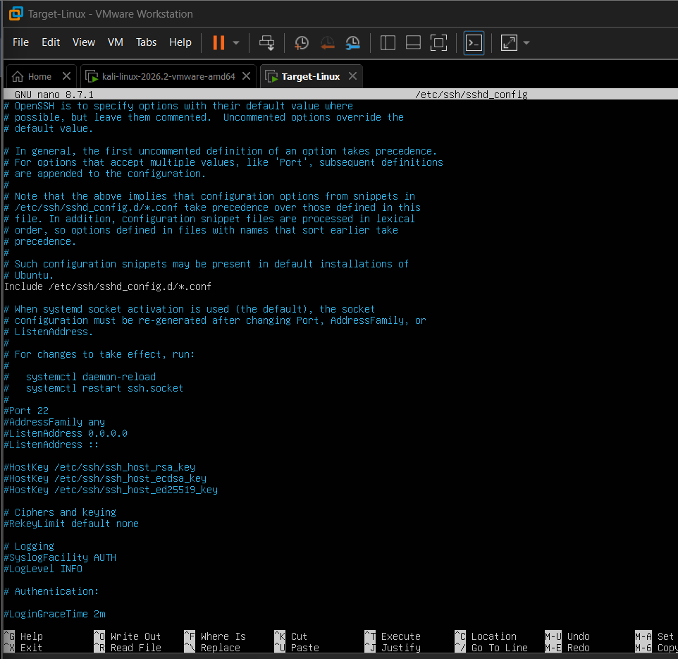
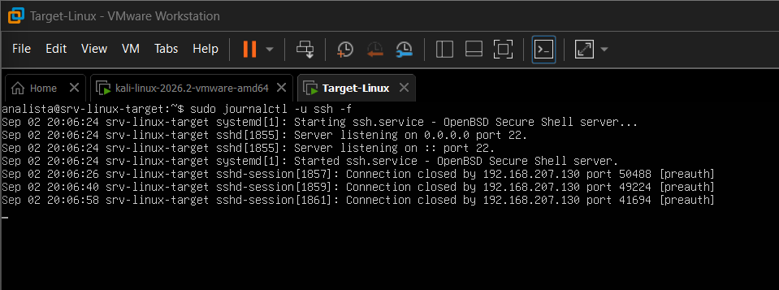
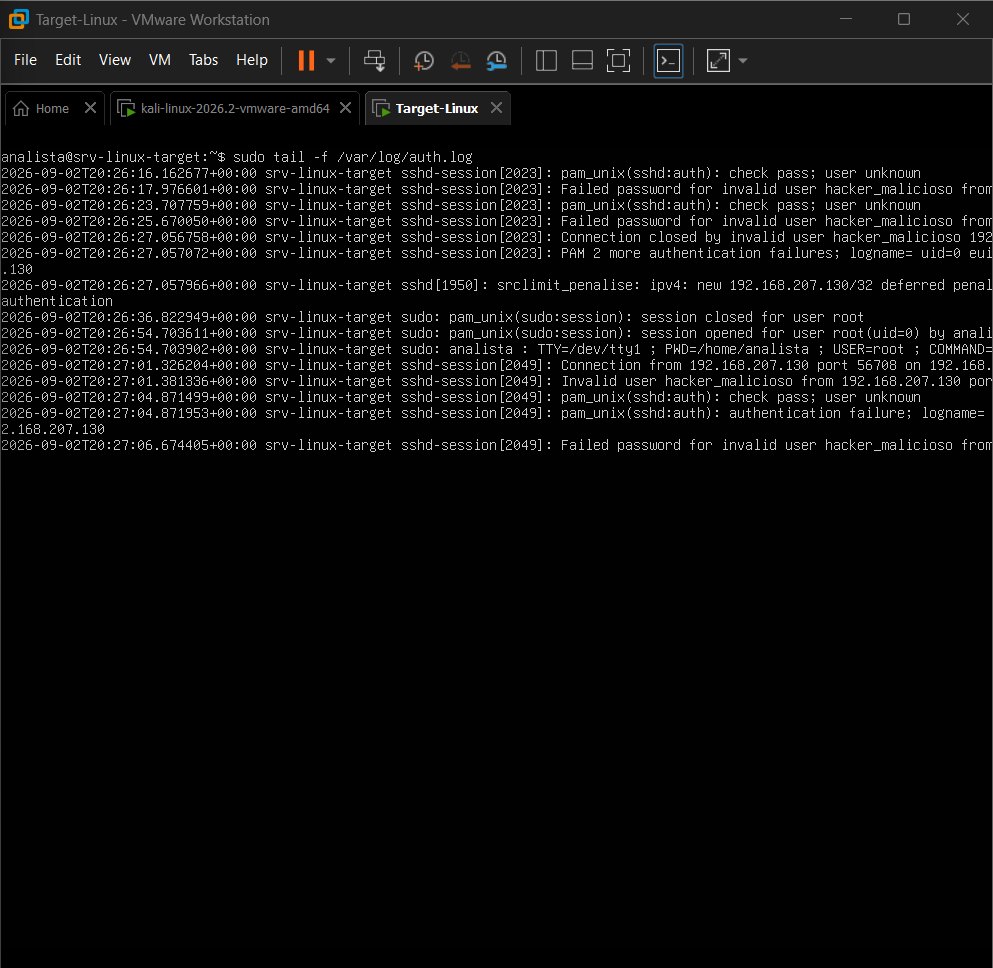
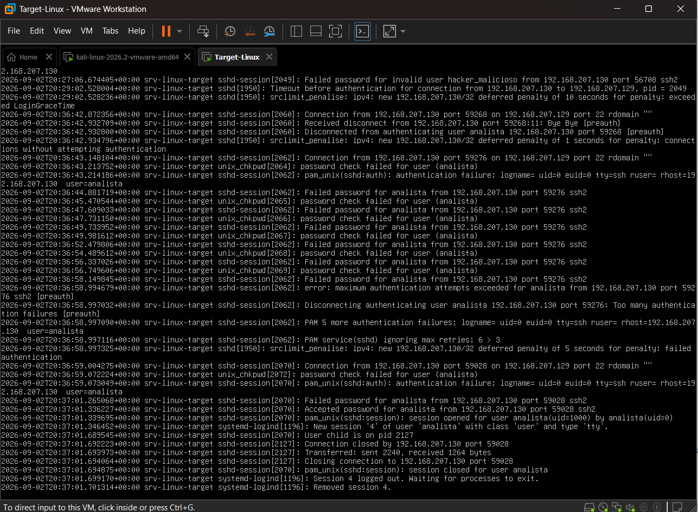

# Relatorio de Incidente: Deteccao e Analise de Ataque de Forca Bruta SSH no Linux

## 1. Sumario Executivo
Durante o monitoramento de seguranca do host `srv-linux-target`, foi identificada uma atividade anomala de autenticacao em uma janela curta de tempo. A analise dos registros de auditoria (`/var/log/auth.log`) confirmou um ataque de forca bruta automatizado contra a conta local `analista`, originado do endereco IP interno `192.168.207.130`.

O ataque resultou em multiplas falhas consecutivas seguidas por uma sessao bem-sucedida, indicando comprometimento da credencial. Acoes imediatas de contencao em nivel de rede foram aplicadas no endpoint via `iptables`.

---

## 2. Detalhes Tecnicos do Ambiente

* **Host Alvo (Vitima):** `srv-linux-target`
  * **Sistema Operacional:** Ubuntu Server 24.04 LTS
  * **Endereco IP:** `192.168.207.129`
  * **Servico Afetado:** OpenSSH (Porta 22/TCP)
* **Host Atacante (Origem):**
  * **Sistema Operacional:** Kali Linux
  * **Endereco IP:** `192.168.207.130`
  * **Ferramenta Empregada:** THC-Hydra v9.7

---

## 3. Mapeamento MITRE ATT&CK

| Tatica | Tecnica | ID | Descricao |
|---|---|---|---|
| Credential Access | Brute Force: Password Guessing | T1110.001 | Tentativas sucessivas de quebra de senha via dicionario. |
| Initial Access | Valid Accounts: Local Accounts | T1078.003 | Uso de credenciais validas obtidas para logon no sistema. |

---

## 4. Configuracao da Telemetria

Para garantir a visibilidade necessaria sobre as tentativas de conexao e autenticacao no servidor, o nivel de log do daemon OpenSSH foi elevado de `INFO` para `VERBOSE` no arquivo `/etc/ssh/sshd_config`.



---

## 5. Linha do Tempo e Execucao do Ataque

### A. Reconhecimento e Primeiras Tentativas de Conexao
A partir do host atacante (`192.168.207.130`), foram realizadas conexoes iniciais que encerraram antes da conclusao da negociacao de autenticacao (`preauth`).



### B. Enumeracao de Usuarios Inexistentes
Em seguida, foram submetidas credenciais arbitrarias. O subsistema PAM e o servico OpenSSH registraram a tentativa com conta inexistente no sistema operacional (`Invalid user hacker_malicioso`).



### C. Ataque de Forca Bruta e Comprometimento da Conta
O atacante direcionou o ataque contra a conta valida `analista`. Apos o disparo, o arquivo `/var/log/auth.log` registrou o seguinte comportamento sequencial:

* **20:36:44 a 20:36:58:** Registro de falhas consecutivas de senha (`Failed password for analista`).
* **20:36:58:** O servico OpenSSH atingiu o limite maximo de tentativas por conexao e finalizou a sessao inicial (`error: maximum authentication attempts exceeded`).
* **20:36:59:** A ferramenta reabriu conexao imediata em uma nova porta efemera (`59028`) para prosseguir com os testes de credencial.
* **20:37:01:** **Comprometimento:** O atacante submeteu a credencial correta. O sistema registrou `Accepted password`, abriu uma sessao PAM e alocou um terminal TTY via `systemd-logind`.



---

## 6. Procedimentos de Triagem e Investigacao via CLI

No processo de resposta a incidentes, foram executados filtros em linha de comando no host alvo para quantificar o evento e validar o comprometimento:

1. **Total de falhas de autenticacao detectadas:**
   ```bash
   sudo grep "Failed password" /var/log/auth.log | wc -l
